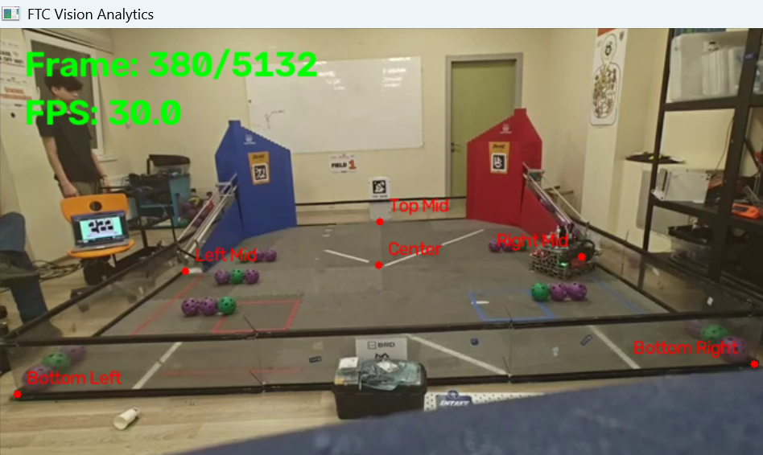

# FTC Vision Analytics

Computer vision software for analyzing FIRST Tech Challenge matches.

## Features

### Video Analysis
- Load FTC match videos
- Real-time video playback
- Pause and resume playback
- Frame-by-frame navigation
- Display current frame number and FPS

### Field Calibration
- Select field reference points manually (Mouse-click)
- Support for 6 calibration points
- Named calibration points
- Visualize selected points on the video frame
- Reset selected points (R)
- Define real-world field coordinates
- Calculate homography matrix

## Preview

Field calibration with selected reference points:

## Roadmap

- [x] Milestone 1: Video Controls
- [x] Milestone 2: Field calibration
- [ ] Milestone 3: Bird's-eye transformation
- [ ] Milestone 4: Robot tracking
- [ ] Milestone 5: Heatmaps
